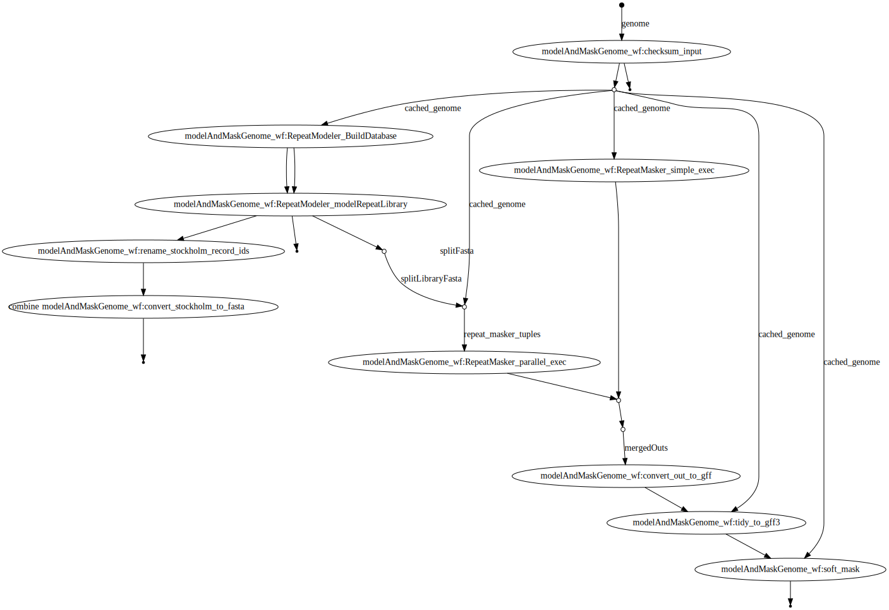

# repeatModeler2_nf
A Nextflow wrapper for RepeatModeler2.

Dependencies:
* Singularity
* Nextflow
* Miniconda

If you have set the '--genome' parameter, and have access to Miniconda / Singularity, and given the path to your tandem repeat finder (TRF) executable under the 'runOptions' in nextflow.config, this pipeline should 'just work' and automatically pull necesarry containers and install software via conda.

Run:
'nextflow run repeatModeler.nf -resume --genome example.fa'

Results:
 

RepeatModeler2 citation:
Flynn JM, Hubley R, Goubert C, Rosen J, Clark AG, Feschotte C, Smit AF. 2020. RepeatModeler2 for automated genomic discovery of transposable element families. PNAS. doi:10.1073/pnas.1921046117

DAG:

